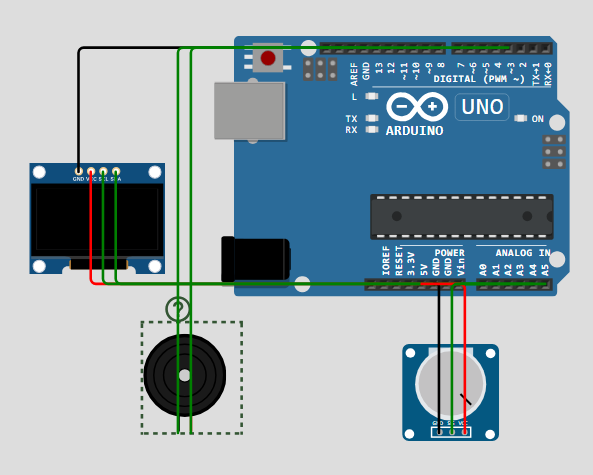

# Projeto de Monitoramento do Nível do Mar
## **<li>Matheus Henriques do Amaral - RM 556957</li>**

Este projeto é uma simulação de monitoramento do nível do mar. Um potenciômetro é usado para simular as variações no nível do mar, cujos valores são exibidos em um display OLED. Quando o nível do mar excede um determinado limite, um alerta sonoro é acionado através de um buzzer. O código foi desenvolvido e simulado na plataforma Wokwi.

## Sumário

- [Prévia](#previa)
- [Hardware](#hardware)
- [Bibliotecas](#bibliotecas)
- [Software](#software)
- [Links importantes](#links-importantes)
- [Licença](#licença)

### Prévia do projeto 

 

### Hardware

- Arduino Uno
- Display OLED (SSD1306)
- Buzzer
- Potenciômetro
- Conexões Jumpers

### Bibliotecas

- [Adafruit GFX Library](https://github.com/adafruit/Adafruit-GFX-Library)
- [Adafruit SSD1306 Library](https://github.com/adafruit/Adafruit_SSD1306)

### Software

- [Arduino IDE](https://www.arduino.cc/en/software)
- [Wokwi](https://wokwi.com/) para simulação

### Links importantes

- [Acesse o projeto no **Wokwi**](https://wokwi.com/projects/399926163863267329)
- [Vídeo explicativo no **YouTube**](https://youtu.be/K5-kY4fGBLc)

### Licença

Este projeto está licenciado sob a [MIT License](LICENSE).

